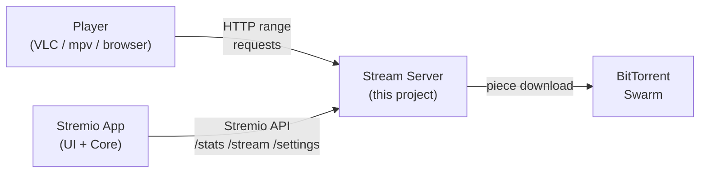
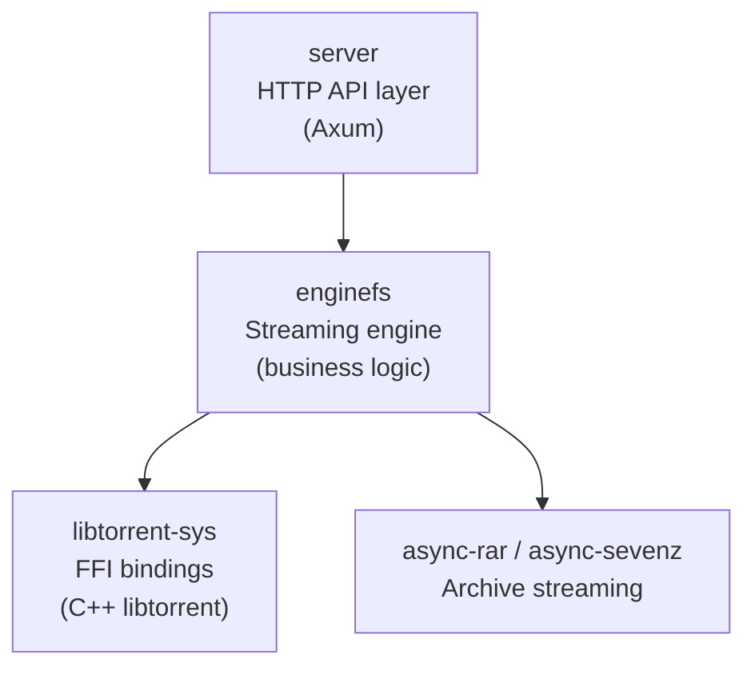
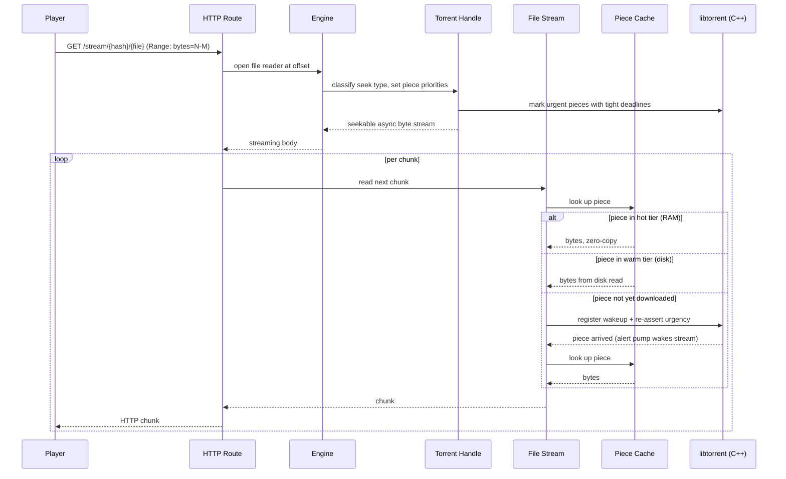
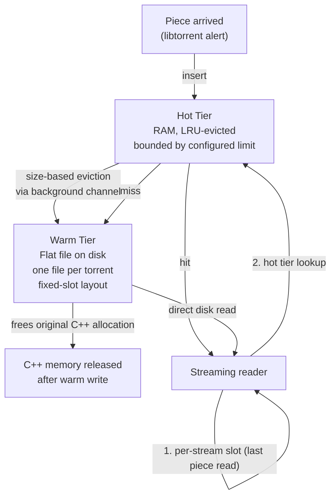
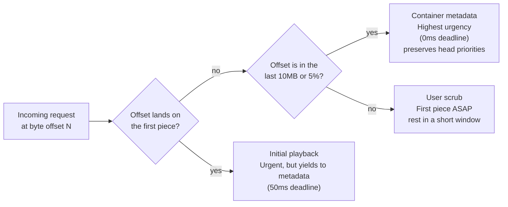
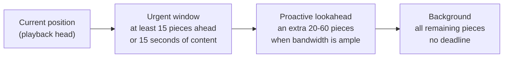
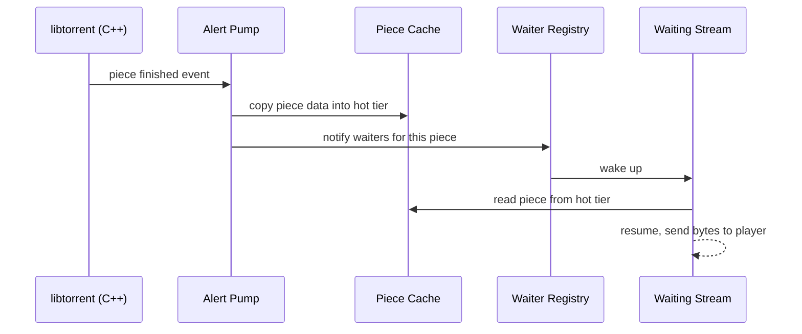
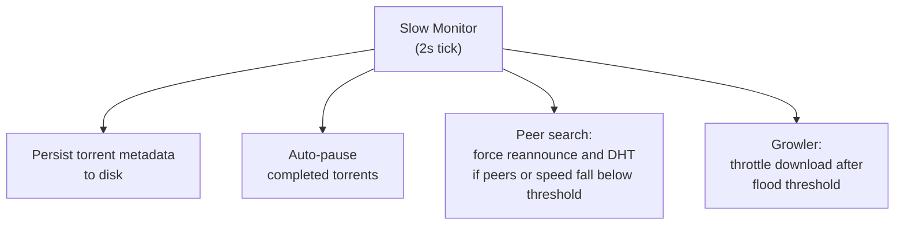
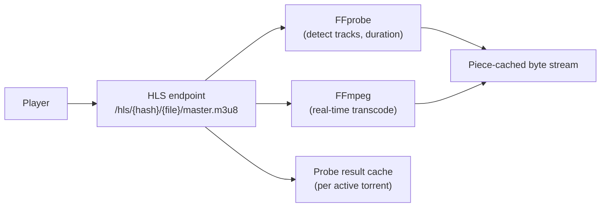

# Stream Server: Architecture

## Goal

Stream Server is an open-source, drop-in replacement for Stremio's proprietary `server.js`. It exposes the same HTTP API but is written in Rust, giving native performance with a small memory footprint.

The server is the only piece that touches the network for torrents. The player and the Stremio UI both connect to it locally.

---

## Directory structure

The repository is a Cargo workspace. Each crate has a single responsibility:

- **server** handles HTTP routing, settings, system tray and TUI. It has no knowledge of torrents.
- **enginefs** owns everything about torrents: downloading, caching, seeking, HLS transcoding. It is backend-agnostic by design.
- **libtorrent-sys** is a thin bridge to the C++ libtorrent library. Pure FFI with no business logic.
- **async-rar / async-sevenz** provide async streaming readers for archive formats.

---

## Backend Abstraction

`enginefs` is backend-agnostic. Two backends exist; only one is compiled per build:

| Backend | Technology | Use case |
|---------|-----------|---------|
| `libtorrent` | C++ libtorrent-rasterbar | Default for production. Memory-only storage mode. |
| `librqbit` | Pure Rust | Experimental. Easier to cross-compile. |

The backend exposes two contracts:

- A **session contract** for adding, removing, and listing torrents.
- A **handle contract** for per-torrent operations: opening a file reader, setting piece priorities, and reading stats.

A session wrapper sits on top of the active backend and adds session-level concerns: engine lifecycle, disk cache, and active-stream tracking.

---

## Request Lifecycle (Direct Stream)

The critical path from player request to bytes:

---

## Piece Cache: Two-Tier Architecture

The hybrid cache is the core memory management mechanism introduced in this fork. Its goal is to serve pieces with sub-millisecond latency while keeping RAM usage bounded regardless of how much of a file has been downloaded.

**Why a flat-file warm tier?** Each piece occupies a fixed-size slot at a deterministic offset on disk, so any piece can be found in O(1) by index without a database or index file.

**Why bound the hot tier?** Without eviction, a 1-hour HD movie at typical piece sizes accumulates several gigabytes of RAM. The hot tier keeps only the active working set; older pieces spill to disk automatically.

**Per-stream slot** Each open stream remembers the last piece it served. Sequential reads within the same piece skip both tier lookups entirely.

---

## Seek Classification

When a player opens a file it typically fires several HTTP connections simultaneously with different byte offsets: one for the start of the video, one for end-of-file container metadata (the index that tells the player where every frame is), and sometimes one for the user's chosen scrub position. If all of these compete with equal urgency, libtorrent resolves the tie by piece index, meaning end-of-file metadata pieces queue behind thousands of earlier pieces and can stall for tens of seconds.

To avoid this, every incoming connection is classified into one of four intents the moment it arrives:

The classification is stamped on the connection at seek time and applied on the first read, then discarded. All subsequent sequential reads within the same connection are treated as normal streaming.

**Why initial playback does not get the highest deadline:** When a player opens both a playback connection and a metadata connection simultaneously, both connections keep re-asserting urgency on their target pieces. If both claim the absolute highest priority, the piece picker again falls back to index order and the end-of-file metadata piece waits behind all earlier ones. Giving initial playback a slightly lower urgency lets container metadata win the race, so the player can parse the file structure quickly and begin showing the video while head pieces continue downloading.

---

## Priority Window

Around the current playback position, pieces are grouped into zones of decreasing urgency:

The window is **dynamic**: when download speed comfortably exceeds the content bitrate, the lookahead expands to build a larger buffer. When the connection is slow, it shrinks to focus bandwidth on the pieces the player needs right now.

Each open stream applies a small timing offset (jitter) to its deadline assignments. Without this, multiple simultaneous connections would stamp identical deadlines on their respective pieces, causing the piece picker to serve them round-robin rather than in the priority order intended.

---

## Alert Pump

libtorrent runs inside the server process and communicates finished work through an alert queue rather than callbacks. The alert pump is a background loop whose sole job is to drain that queue and translate each "piece finished" event into an action the rest of the server can react to.

When a piece finishes downloading, three things happen in sequence:

**Copying into the cache first** is intentional. The piece data lives in C++ memory by default. By copying it into the managed hot tier immediately, the server can later evict it from C++ and reclaim that memory, keeping RSS bounded. If the piece were served directly from C++ memory without this copy, the C++ allocation would have to live as long as any stream could possibly seek back to it.

**Notifying waiters second** ensures a stream is never woken before the data is actually readable from the cache. A stream that wakes up and finds the piece missing would have to go back to sleep, wasting a scheduling round-trip.

**Peek-then-drain** keeps the alert pump from holding a write lock on the libtorrent session during idle periods. The pump checks for pending alerts under a cheap read lock first, and only upgrades to a write lock when alerts are actually present. During normal playback buffering, when alerts arrive in bursts separated by quiet intervals, this eliminates roughly 50 unnecessary write-lock acquisitions per second.

**Safety-net wakeup** A streaming connection that is waiting for a piece also schedules a short-delay wakeup as a fallback. This guards against a narrow race where the piece finishes between the moment the stream checks availability and the moment it registers its wakeup. Without this, a missed notification would stall the stream indefinitely.

---

## Slow Monitor

A separate background task runs every 2 seconds and handles non-latency-sensitive housekeeping:

This task deliberately does **not** touch piece priorities. Priority changes from the monitor raced with priority changes made when a stream opens, producing situations where the monitor silently zeroed out urgency that the stream had just set.

---

## HLS Path

When the player cannot handle the container format natively, the server transcodes in real time via FFmpeg:

The probe result (track list, duration, codec info) is cached per active torrent so repeated opens do not re-invoke FFprobe. Both the prober and the transcoder read from the same piece-cached byte stream used for direct streaming, so they get the same seek classification and hot-tier benefits.

---

## What This Fork Added

This fork starts from the v0.1.1-beta.1 release of the upstream project. Eight commits on top of that baseline address three distinct problem areas.

### Faster and safer piece reading from C++

Piece data originates in C++ memory. The original read path copied each byte individually in a loop, making a single piece read take around 7ms. For a 1-hour movie that added over 13 seconds of pure copy overhead. The fix replaces the loop with a bulk memory copy, bringing piece read latency below 1ms. The C++ storage layer also gained keyed lookup so pieces can be read or freed by torrent identity without acquiring the global session lock.

### Deterministic seek classification (see PLAN-002 for full details)

The original server tried to detect seeks by watching how far the playback position jumped between reads. This heuristic broke in several ways for incomplete torrents under concurrent connections:

- A small offset at the very start of a file (still within the first piece) was misclassified as a user scrub and given a loose deadline, overwriting the tight deadline another connection had just placed on the same piece.
- A torrent that had been paused showed a download speed of zero. The server penalised this with a doubled deadline multiplier, making seeks slower immediately after the resume that was triggered to serve the request.
- Clearing all existing piece deadlines on a user scrub wiped urgency from pieces that a sibling connection was actively waiting for, stalling that connection for the full remaining download duration.
- Priority-setting work ran unconditionally on every seek even for files that were already fully downloaded, wasting time on FFI calls that had no effect.
- The cache was read using a blocking executor call inside an async context, which stalled the worker thread for the duration of the cache lookup.

All five were fixed by classifying the intent of each connection once, at open time, based on which piece the offset lands in rather than watching position deltas.

### Hybrid two-tier piece cache (see PLAN-003 for full details)

The previous cache stored each piece as an individual file on disk and had no memory cap. For long content this accumulated several gigabytes in C++ RAM with no relief. The replacement uses the two-tier design described in the Piece Cache section above: a bounded RAM hot tier with size-based LRU eviction, and a flat-file warm tier on disk. When a piece is evicted from the hot tier it is written to disk and the original C++ allocation is freed, returning memory to the OS. The eviction path explicitly reports I/O success so failures are logged and can be retried rather than silently losing piece data.

### Alert pump CPU reduction

Previously the alert pump checked for new alerts every 20ms unconditionally, acquiring a write lock on the libtorrent session each time. During buffering pauses between playback requests, this produced roughly 50 unnecessary write-lock acquisitions per second with no useful work. The pump now checks for pending alerts under a read lock first and only upgrades to a write lock when alerts are actually present.

---

## Key Design Constraints

| Constraint | Rationale |
|-----------|----------|
| Memory-only storage during streaming | Pieces live in managed memory during streaming. There are no on-disk torrent data files. The warm cache tier is separate from torrent storage. |
| One active file at a time | Only one file's pieces are downloaded at any moment. This prevents bandwidth scatter across multi-file or multi-episode torrents where the user wants a single item. |
| Session lock released before I/O | The exclusive lock on the libtorrent session is dropped before any cache writes or alert processing. Holding it across I/O would block all other torrent operations. |
| All cache reads are synchronous | Streaming reads happen on async worker threads. Blocking a worker thread during a cache lookup would starve other concurrent streams. Both cache tiers are designed for O(1) synchronous access. |
| Per-stream deadline jitter | Concurrent connections must not all stamp identical deadlines on their pieces, or the piece picker degrades to index-order selection. Small per-connection offsets preserve intended priority ordering. |
